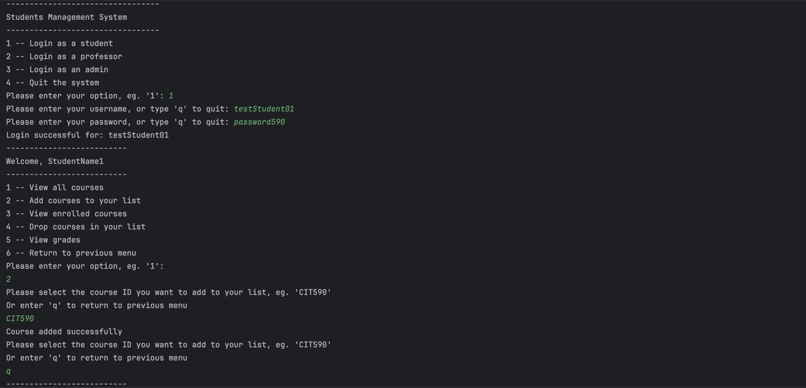
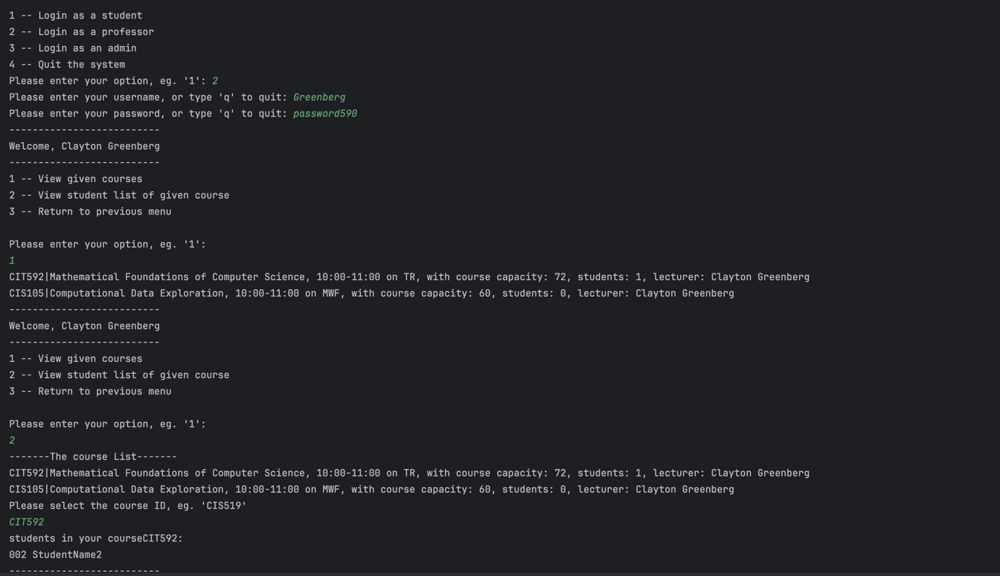
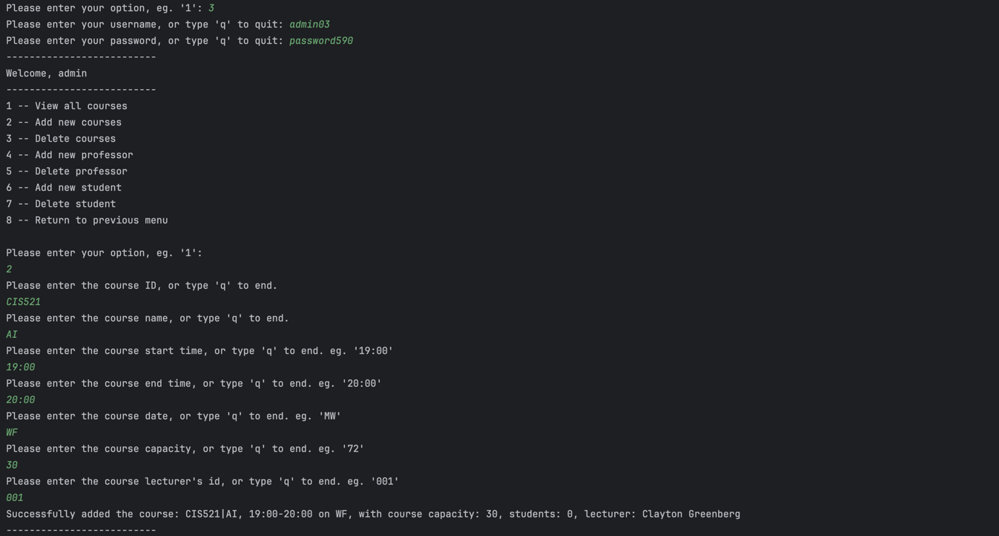

# Student Management System
A student management system for student, professor and administrator

## Quick Intro
* Developed an object-oriented system comprising over 2000 lines of code, enabling students and professors to
add/drop/view courses, and empowering administrators to manage students, professors, and courses effectively
* Designed a FileInfoReader class to parse various text files, extracting data like usernames, password, and course
information
* Reduced code repetition by extending a superclass with common functionalities and calling static methods in a
course-related class; overrode specific methods to customize behaviors of each role
* Implemented real-time data update while keeping variables private, such as reflection of new student enrollments in
professor’s courses rosters

## Menu

*This is student login page and menu for student*

*This is professor login page and menu for professor*

*This is administrator login page and menu for admin*